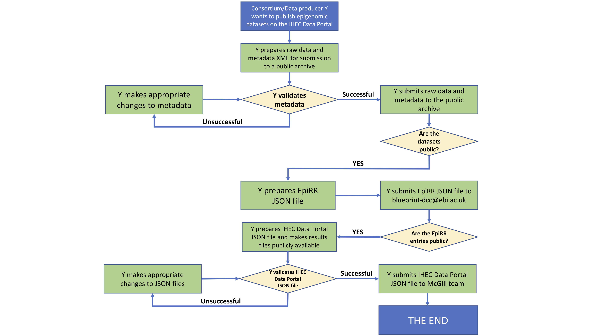

# Contributing a dataset to IHEC

## Overall Process

Submission to IHEC is a multistage process which involves 3 submissions:
1. submission of the raw data to a public archive (e.g. [EGA](https://www.ebi.ac.uk/ega/), [DDBJ](https://www.ddbj.nig.ac.jp/index-e.html) or [dbGaP](https://www.ncbi.nlm.nih.gov/gap/))
2. submission of the metadata to the [EpiRR registry](https://www.ebi.ac.uk/vg/epirr)
3. submission of analysis files to the [IHEC Data Portal](https://epigenomesportal.ca/ihec/)

To avoid too many iterations, IHEC provides automatic validation software to verify compliance at the start of the process.

## 1. Metadata preparation

The metadata is stored and transmitted as an XML file. Here are instructions on [metadata preparation](../docs/metadata/1.0/Ihec_metadata_specification.md).

## 2. Raw data submission

Having prepared the metadata, proceed to submit the raw experimental data to the archive of your choice. For sequencing raw data, the preferred format is FASTQ (over BAM and others). 

## 3. EpiRR submission

Having submitted data into the archive, you should now have global identifiers for your dataset, samples and experiments. You can now prepare an [EpiRR JSON submission file](https://github.com/Ensembl/EpiRR#submission)

## 4. IHEC Data Portal submission

Having submitted metadata into EpiRR, you should now have EpiRR identifiers to each epigenome. You can now use this information to link publicly visible analysis files (in BigBed and BigWig format) to the epigenome using an [IHEC Data Hub JSON file](../IHEC_Data_Hub/README.md)
